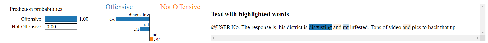
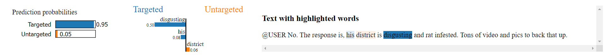
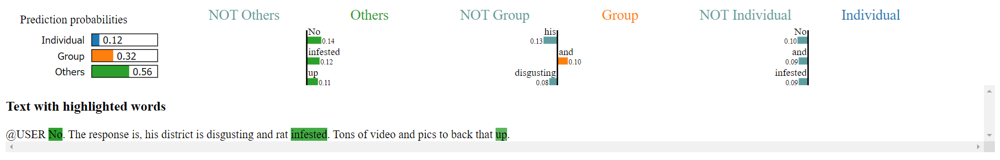

# 🚀 Offensive Language and Toxic Content Detection with Visualization

## 📖 Overview

This repository contains the implementation of a **FastText-based machine learning model** for identifying offensive language and toxic content in tweets. The project uses the **OLID** and **SOLID datasets** for training and testing. It also integrates the **LIME (Local Interpretable Model-Agnostic Explanations)** technique to enhance local interpretability and explanability by visually showing key words that influenced the model's decisions.

The project is designed to classify offensive language at three levels:
1. **Offensive Language Detection**: Determines whether a text is offensive or not.
2. **Categorization of Offensive Language**: Classifies offensive language as **targeted** or **untargeted**.
3. **Target Identification**: Identifies the target of offensive language as an **individual**, **group**, or **others** (e.g., organizations, events).

This repository is ideal for researchers, developers, and data scientists working on **natural language processing (NLP)**, **toxic content moderation**, or **social media analysis**.

---

## ✨ Features

- **FastText Model**: 
  - Utilizes subword representations for efficient and robust text classification.
  - Fast training on large-scale text data with minimal preprocessing.
- **Datasets**:
  - **OLID**: 14,100 manually labeled tweets with a three-level taxonomy.
  - **SOLID**: 9 million semi-supervised labeled tweets for large-scale training.
- **LIME Visualizations**: Enhances interpretability by explaining predictions made by the model.
- **Hierarchical Approach**: Multi-level classification for granular offensive language detection.
- **Predefined Scripts**: Simplifies training, evaluation, and visualization through dedicated Python scripts.

---

## 📊 Visualization Examples for Explainability

Below are examples of **LIME (Local Interpretable Model-Agnostic Explanations)** visualizations. The project interprets model predictions by highlighting the influential words or regions for offensive language classification.

  
    Figure 1: LIME Visualization for Offensive Language Detection

  
    Figure 2: LIME Visualization for Categorization of Offensive Language

  
    Figure 3: LIME Visualization for Target Identification

---

## 📂 Project Structure

### **Folders**
1. **OLID Dataset**: Contains the training set, test set labels, and test set tweets for OLID.
2. **SOLID Dataset**: Contains the training set, test set labels, and test set tweets for SOLID.

### **Codes**
1. **`train_fasttext.py`**: A Python script to train FastText models on OLID and/or SOLID datasets. It supports three classification levels.
2. **`test_fasttext.py`**: A Python script to evaluate the trained FastText models on the SOLID test set and generate classification reports for each level.
3. **`lime_popup.py`**: A Python script that uses the LIME technique to interpret and visualize individual model predictions.
4. **`settings.py`**: Contains hyperparameters and other settings shared across the other Python scripts.

### **Files**
1. **`Results/results_fasttext_dataX_preprocessY.txt`**: Six files storing classification reports for FastText models across three levels:
   - `data1`: OLID only
   - `data2`: SOLID only
   - `data3`: OLID + SOLID
   - `preprocessTrue`: With tweet text preprocessing
   - `preprocessFalse`: Without tweet text preprocessing
2. **`model_fasttext_a/b/c.bin`**: Saved FastText models for the three classification levels.
   **Note**: The model checkpoint files (`model_fasttext_a.bin`, `model_fasttext_b.bin`, `model_fasttext_c.bin`) are too large to upload to this repository.
3. **`Documentation.docx`**: Detailed documentation about the project.

---

## 📊 Datasets

### OLID (Offensive Language Identification Dataset)
- 14,100 English tweets manually labeled using a **three-level taxonomy**:
  1. Offensive Language Detection
  2. Categorization of Offensive Language
  3. Offensive Language Target Identification
- Public dataset for offensive language classification on social media.

### SOLID (Semi-Supervised Offensive Language Identification Dataset)
- 9 million English tweets created using a semi-supervised approach.
- Significantly larger dataset to improve model performance.
  
**Note**: The `SOLID Dataset` folder is too large to include in this repository. You can access it via the [HuggingFace Page for SOLID](https://huggingface.co/datasets/tharindu/SOLID/tree/refs%2Fconvert%2Fparquet/default/train).

---

## ⚙️ Installation

### Prerequisites
- **Python 3.7**
- Required Python libraries:
  - `pandas`, `numpy`, `fasttext`, `nltk`, `sklearn`, `tqdm`, `re`, `os`, `random`, `lime`, `tkinter`

---

## 🛠️ Usage

### Training
- Train the FastText model using the `train_fasttext.py` script.
- Combine OLID and SOLID datasets or use them independently during training.

### Evaluation
- Test the trained model on the SOLID test set using the `test_fasttext.py` script.
- Classification metrics (accuracy, precision, recall, F1-score) are provided for each task.

### Visualization
- Use the `lime_popup.py` script to generate **LIME explanations** for model predictions.
- Explanations are saved as HTML files and displayed in a pop-up window.

---

## 📈 Results

### Task A: Offensive Language Detection
- **Accuracy**: 0.92
- **F1-Score**: 0.91 (NOT), 0.92 (OFF)

### Task B: Categorization of Offensive Language
- **Accuracy**: 0.54
- **F1-Score**: 0.68 (UNT), 0.24 (TIN)

### Task C: Offensive Language Target Identification
- **Accuracy**: 0.60
- **F1-Score**: 0.54 (IND), 0.73 (GRP), 0.19 (OTH)

---

## 📚 References

1. **OLID Dataset**: [Predicting the Type and Target of Offensive Posts in Social Media (NAACL-HLT 2019)](https://sites.google.com/site/offensevalsharedtask/home)
2. **SOLID Dataset**: [SOLID: A Large-Scale Semi-Supervised Dataset for Offensive Language Identification (ACL-IJCNLP 2021)](https://arxiv.org/abs/2106.04588)
3. **FastText**: [Enriching Word Vectors With Subword Information (TACL 2017)](https://arxiv.org/abs/1607.04606)
4. **LIME**: [LIME GitHub Repository](https://github.com/marcotcr/lime)

---

## 🔗 Useful Links

- [FastText Documentation](https://fasttext.cc/)
- [LIME Introduction](https://www.oreilly.com/content/introduction-to-local-interpretable-model-agnostic-explanations-lime/)
- [Kaggle: Jigsaw Toxic Comment Classification Challenge](https://www.kaggle.com/competitions/jigsaw-toxic-comment-classification-challenge/overview)
- [HuggingFace Page for SOLID](https://huggingface.co/datasets/tharindu/SOLID/tree/refs%2Fconvert%2Fparquet/default/train)

